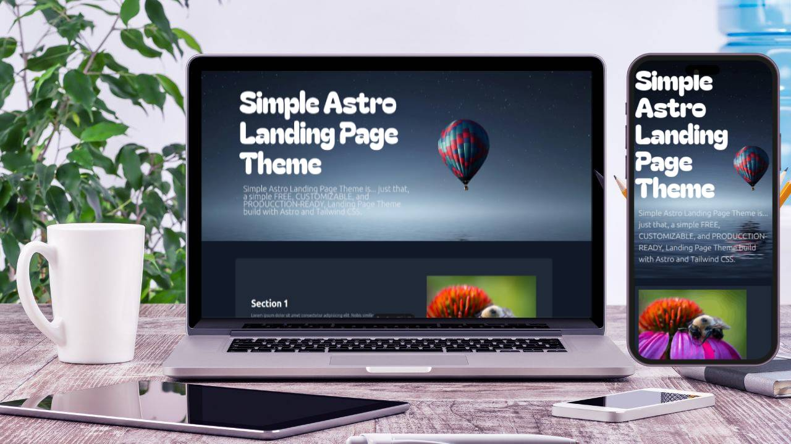

# Simple Astro Landing Page Theme

## A simple Landing Page built with Astro, TailwindCSS and TypeScript



Simple Astro Landing Page Theme is... just that, a simple FREE, CUSTOMIZABLE, and PRODUCCTION-READY, Landing Page Theme build with Astro and Tailwind CSS.

### 📋 Features

Simplicity and High Performance.

- [x] Astro 4.15
- [x] TylwindCSS
- [x] TypeScript
- [x] Responsive
- [x] SEO-friendly
- [x] OG
  - [x] Description
  - [x] Image

## 🚀 Project Structure

Inside of your Simple Astro Landing Page project, you'll see the following folders and files:

```text
/
├── public/
│   └── img/
│       └── img_00.jpg
│       └── img_01.jpg
│   └── favicon.svg
├── src/
│   └── components/
│       └── Footer.astro
│       └── Hero.astro
│       └── Section.astro
│   └── pages/
│       └── index.astro
│   └── styles/
│       └── global.css
│   └── env.d.ts
├── .gitignore
├── astro.config.mjs
├── package.json
├── package-lock.json
├── tailwind.config.mjs
└── tsconfig.json
```

As a simple landing page, we only provide a single page which is going to be rendering the different components: Footer, Hero, and Section.

## 🧞 Commands

All commands are run from the root of the project, from a terminal:

| Command                   | Action                                                     |
| :------------------------ | :--------------------------------------------------------- |
| `npm install`             | Installs dependencies from package.json                    |
| `npm clean-install`       | Installs dependencies from package-lock.json (Recommended) |
| `npm run dev`             | Starts local dev server at `localhost:4321`                |
| `npm run build`           | Build your production site to `./dist/`                    |
| `npm run preview`         | Preview your build locally, before deploying               |
| `npm run astro ...`       | Run CLI commands like `astro add`, `astro check`           |
| `npm run astro -- --help` | Get help using the Astro CLI                               |

## ⭐ Feedback and bugs 🐞

If you find any bug or just want to give your feedback (remember the ⭐ ^^), **Feel free to do it**. I am, like you, constantly learning and things change so quickly that... no one knows ^^

## Version control 📝

- [v1.0 - Current](https://github.com/Inushin/simpleAstroLandingPageTheme/tree/v1.0) - Creation of the rep with the theme finished
